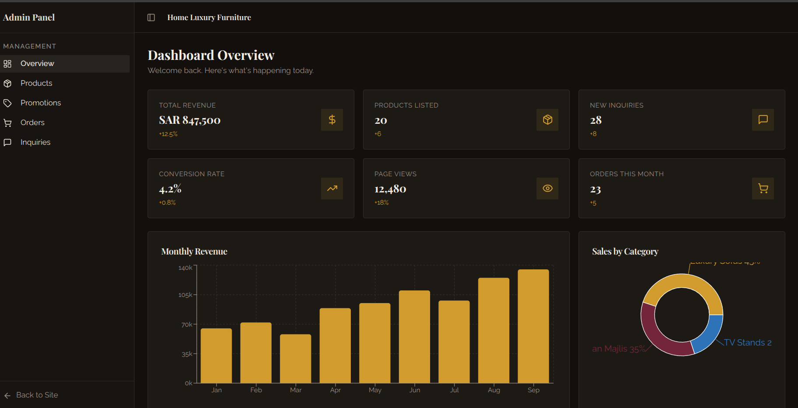
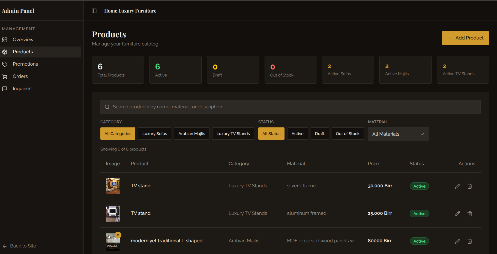
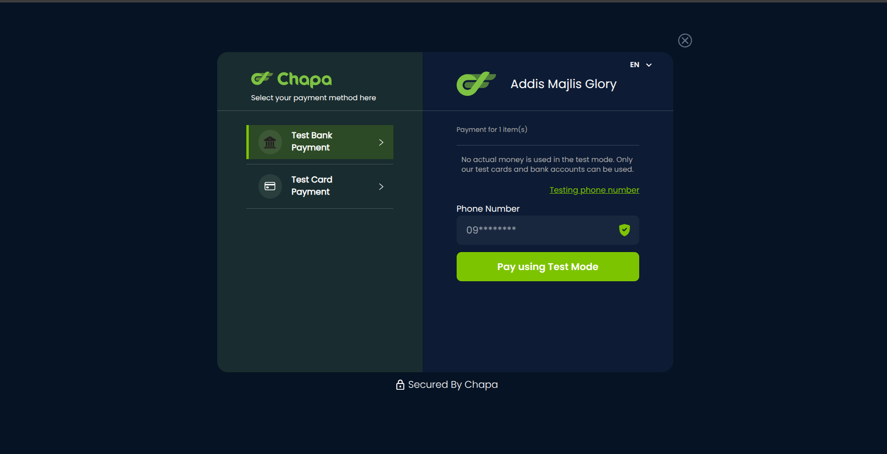

# Addis Majlis Glory - Luxury Furniture E-Commerce Platform

A full-stack e-commerce platform for luxury furniture, featuring Arabian Majlis, luxury sofas, and TV stands. Built with React, NestJS, and MongoDB.

## 🌟 Features

- **Product Catalog**: Browse luxury sofas, Arabian Majlis, and TV stands
- **Shopping Cart**: Add products to cart with color selection
- **Payment Integration**: Chapa payment gateway integration
- **Admin Panel**: Manage products, orders, promotions, and inquiries
- **Responsive Design**: Mobile-friendly interface
- **Image Management**: Cloudinary integration for image storage
- **Promotions**: Special offers and discounts
- **Customer Inquiries**: Contact form for customer questions

## 📸 Screenshots

Here are some screenshots of the application:

| Screenshot | Description |
|------------|-------------|
|  | Home Page |
|  | Product Catalog |
|  | Product Details |
|  | Payment Page |

## 🛠️ Tech Stack

### Frontend
- **React 18** with TypeScript
- **Vite** for fast development
- **TailwindCSS** for styling
- **Shadcn/ui** component library
- **Framer Motion** for animations
- **React Router** for navigation
- **React Query** for data fetching

### Backend
- **NestJS** framework
- **MongoDB** with Mongoose
- **Cloudinary** for image storage
- **Chapa** payment gateway
- **Express** server

### DevOps
- **Docker** & Docker Compose
- **Nginx** for production serving

## 📋 Prerequisites

- Node.js 20 or higher
- Docker & Docker Compose
- MongoDB Atlas account
- Cloudinary account
- Chapa payment gateway account

## 🚀 Quick Start

### Using Docker (Recommended)

1. **Clone the repository**
   ```bash
   git clone <repository-url>
   cd addis-majlis-glory-main
   ```

2. **Set up environment variables**
   ```bash
   # Frontend environment
   cp .env.example .env
   
   # Backend environment
   cp backend/.env.example backend/.env
   ```

3. **Edit the environment files with your credentials**

   Frontend `.env`:
   ```env
   VITE_API_URL=http://localhost:4000
   VITE_CHAPA_PUBLIC_KEY=your_chapa_public_key
   ```

   Backend `backend/.env`:
   ```env
   MONGODB_URI=your_mongodb_connection_string
   CLOUDINARY_CLOUD_NAME=your_cloudinary_name
   CLOUDINARY_API_KEY=your_cloudinary_key
   CLOUDINARY_API_SECRET=your_cloudinary_secret
   CHAPA_SECRET_KEY=your_chapa_secret_key
   FRONTEND_URL=http://localhost:8080
   ```

4. **Start the application**
   ```bash
   # Development mode (with hot reload)
   docker compose -f docker-compose.dev.yml up

   # Production mode
   docker compose up -d
   ```

5. **Access the application**
   - Frontend: http://localhost:8080
   - Backend API: http://localhost:4000
   - Admin Panel: http://localhost:8080/admin

### Local Development (Without Docker)

1. **Install dependencies**
   ```bash
   # Frontend
   npm install

   # Backend
   cd backend
   npm install
   cd ..
   ```

2. **Set up environment variables** (same as Docker setup)

3. **Start the development servers**
   ```bash
   # Terminal 1 - Backend
   cd backend
   npm run start:dev

   # Terminal 2 - Frontend
   npm run dev
   ```

4. **Access the application**
   - Frontend: http://localhost:8080
   - Backend API: http://localhost:4000

## 📁 Project Structure

```
addis-majlis-glory-main/
├── public/                    # Static assets
│   ├── fur1.png              # Product preview images
│   ├── fur2.png
│   ├── fur3.png
│   ├── fur4.png
│   ├── favicon.ico
│   └── robots.txt
├── src/                       # Frontend source code
│   ├── components/           # React components
│   ├── contexts/             # React contexts (Cart, Auth)
│   ├── pages/                # Page components
│   ├── lib/                  # Utilities and helpers
│   └── assets/               # Images and media
├── backend/                   # Backend source code
│   ├── src/
│   │   ├── products/         # Product management
│   │   ├── orders/           # Order processing
│   │   ├── users/            # User authentication
│   │   ├── promotions/       # Promotions management
│   │   ├── inquiries/        # Customer inquiries
│   │   ├── chapa/            # Payment integration
│   │   └── cloudinary/       # Image upload service
│   └── uploads/              # Local file uploads
├── docker-compose.yml         # Production Docker config
├── docker-compose.dev.yml     # Development Docker config
├── Dockerfile                 # Frontend production image
├── Dockerfile.dev             # Frontend development image
├── backend/Dockerfile         # Backend production image
├── backend/Dockerfile.dev     # Backend development image
└── nginx.conf                 # Nginx configuration
```

## 🔧 Configuration

### MongoDB Atlas Setup

1. Create a MongoDB Atlas account
2. Create a new cluster
3. Add database user
4. Whitelist IP addresses (use `0.0.0.0/0` for development)
5. Get connection string and add to `backend/.env`

### Cloudinary Setup

1. Create a Cloudinary account
2. Get your cloud name, API key, and API secret
3. Add credentials to `backend/.env`

### Chapa Payment Setup

1. Create a Chapa account
2. Get your public and secret keys
3. Add public key to `.env`
4. Add secret key to `backend/.env`

## 📝 Available Scripts

### Frontend
```bash
npm run dev          # Start development server
npm run build        # Build for production
npm run preview      # Preview production build
npm run lint         # Run ESLint
npm run test         # Run tests
```

### Backend
```bash
npm run start:dev    # Start development server
npm run start        # Start production server
npm run build        # Build for production
npm run seed         # Seed database with sample data
npm run lint         # Run ESLint
```

### Docker
```bash
# Development
docker compose -f docker-compose.dev.yml up        # Start dev containers
docker compose -f docker-compose.dev.yml down      # Stop dev containers
docker compose -f docker-compose.dev.yml logs -f   # View logs

# Production
docker compose up -d                               # Start prod containers
docker compose down                                # Stop prod containers
docker compose logs -f                             # View logs

# Utilities
docker ps                                          # List running containers
docker exec -it addis-majlis-backend-dev sh       # Access backend container
docker exec -it addis-majlis-frontend-dev sh      # Access frontend container
```

## 🗄️ Database Seeding

To populate the database with sample data:

```bash
# Using Docker
docker exec -it addis-majlis-backend-dev npm run seed

# Local development
cd backend
npm run seed
```

## 🔐 Admin Access

To access the admin panel:

1. Navigate to http://localhost:8080/login
2. Create an admin user through the backend API or database
3. Login with admin credentials
4. Access admin panel at http://localhost:8080/admin

## 🌐 API Endpoints

### Products
- `GET /products` - Get all products
- `GET /products/:id` - Get product by ID
- `POST /products` - Create product (admin)
- `PUT /products/:id` - Update product (admin)
- `DELETE /products/:id` - Delete product (admin)

### Orders
- `GET /orders` - Get all orders
- `POST /orders` - Create order
- `GET /orders/:id` - Get order by ID
- `PUT /orders/:id` - Update order status

### Promotions
- `GET /promotions` - Get all promotions
- `POST /promotions` - Create promotion (admin)
- `PUT /promotions/:id` - Update promotion (admin)
- `DELETE /promotions/:id` - Delete promotion (admin)

### Users
- `POST /users` - Register user
- `POST /users/login` - Login user
- `GET /users` - Get all users (admin)

### Chapa Payment
- `POST /chapa/initialize` - Initialize payment
- `GET /chapa/verify?tx_ref=xxx` - Verify payment

### Inquiries
- `POST /inquiries` - Submit inquiry
- `GET /inquiries` - Get all inquiries (admin)

## 🎨 Customization

### Styling
- Modify `tailwind.config.js` for theme customization
- Update colors in `src/index.css`
- Component styles use Tailwind utility classes

### Adding New Products
1. Login to admin panel
2. Navigate to Products section
3. Click "Add Product"
4. Fill in product details and upload images
5. Save and publish

## � Deploymento

### Production Deployment

1. **Build the application**
   ```bash
   docker compose build
   ```

2. **Start production containers**
   ```bash
   docker compose up -d
   ```

3. **Set up reverse proxy** (Nginx/Traefik) for SSL/TLS

4. **Configure domain names** and update environment variables

5. **Set up monitoring** and logging

### Environment Variables for Production

Update the following for production:
- Use production MongoDB URI
- Use production Cloudinary credentials
- Use production Chapa keys
- Set `FRONTEND_URL` to your domain
- Set `VITE_API_URL` to your API domain

## 🤝 Contributing

1. Fork the repository
2. Create a feature branch (`git checkout -b feature/amazing-feature`)
3. Commit your changes (`git commit -m 'Add amazing feature'`)
4. Push to the branch (`git push origin feature/amazing-feature`)
5. Open a Pull Request

## 📄 License

This project is proprietary software. All rights reserved.

## 📞 Contact

- **Phone**: 0995871152
- **Location**: Atlas, Addis Ababa, Ethiopia
- **GitHub**: [birukhabte](https://github.com/birukhabte)

## 🙏 Acknowledgments

- Shadcn/ui for the component library
- Cloudinary for image hosting
- Chapa for payment processing
- MongoDB Atlas for database hosting

---

Built with ❤️ for luxury furniture enthusiasts
